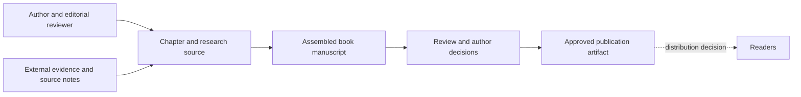
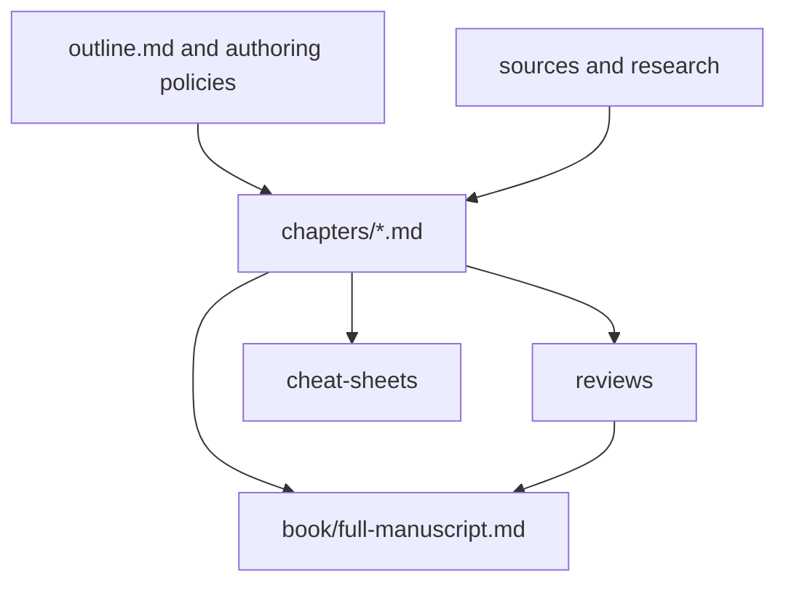
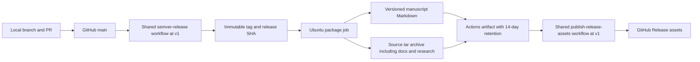

# The Adult Teeth Guide: architecture and diagrams

Scope: `product:adult-dental-care-book`. Reviewed 2026-10-06 (America/Los_Angeles; verification 2026-10-07 UTC). Source revision: `a7c862b82520bdf113c00eeeb565878168712b62`. Prepared by Codex from repository evidence; accountable owner review remains pending.

Source authority: [durable context](../context.md), [README](../../README.md), [outline](../../outline.md) and [claims policy](../../claims-policy.md). The dated [backfill report](reports/2026-10-06-backfill-C0-C2.md) scopes verification.

## Purpose and implementation

The book helps adults understand dental care and evaluate recommendations. Its authoritative purpose and editorial constraints are in the linked context and existing authoring policies. This record describes production of the book; it adds no care recommendations. The implemented system is Markdown content, research records and a GitHub release workflow. A web app, database and hosted reader runtime are not present.

| Canonical Component | Type and source | State / boundary |
| --- | --- | --- |
| `adult-dental-care-book-manuscript` | `content.book`; [book/full-manuscript.md](../../book/full-manuscript.md) | Draft reading artifact, backed by [chapters](../../chapters), research and reviews |
| `adult-dental-care-book-release` | `delivery.github-release`; [release.yml](../../.github/workflows/release.yml) | Implemented pipeline; actual release runs not inspected |

Chapters, cheat sheets and research are source modules, not separate deployable services. The canonical release connection is `adult-dental-care-book-release-publishes-manuscript`.

## System context

Implemented authoring relationships; distribution approval remains a release gate.

## Source and tooling structure

Implemented paths. [scripts/README.md](../../scripts/README.md) is a placeholder for future tooling; there is no implemented manuscript assembly script here.

## Delivery topology and data boundary

Source-defined GitHub topology, not an observed deployment. Local editorial work is the development environment. The GitHub repository is public at this review; all committed content and release archive inputs must be suitable for that boundary.

The shared workflows, GitHub access/billing and an available runner are delivery dependencies. A workflow outage delays a new release; it does not erase already downloaded books. External reference disappearance can undermine later verification, so source identifiers and permitted retained notes matter. No telemetry, customer data store or application HA topology is applicable to this implementation. Public distribution beyond GitHub is unknown.
